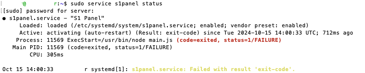
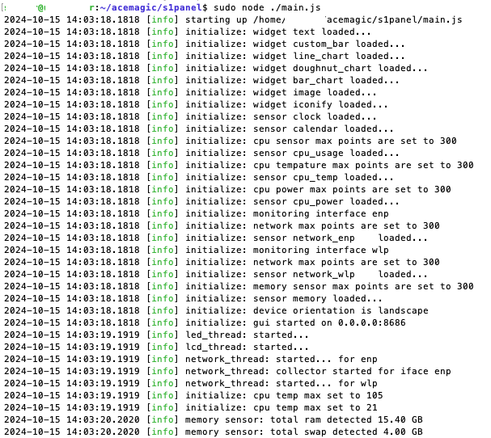
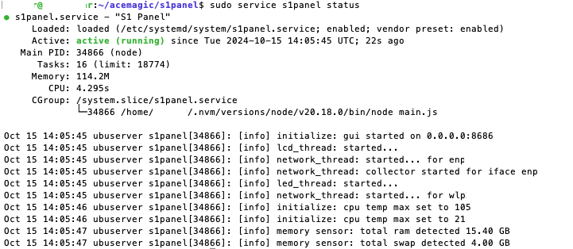

## Service is not running automatically

If the service isn't running automatically, and the output of the status command is similar to:



You can check the logs for more information and run the service manually as follows:

```bash
sudo journalctl -u s1panel
```

If the output have an error message like:

```bash
Oct 15 14:00:01 ubuserver s1panel[1190]: NODE_MODULE_VERSION 115. This version of Node.js requires
Oct 15 14:00:01 ubuserver s1panel[1190]: NODE_MODULE_VERSION 72. Please try re-compiling or re-installing
```
    
and by running from the `acemagic/s1panel` folder with:

```bash
sudo node ./main.js
```
    
The output is similar to:



there might be a problem with node for the sudo command (as shown above by the logs). In that case you need to modify the service file to use the correct node version.

Go to `/etc/systemd/system/s1panel.service` with:
    
```bash
sudo nano /etc/systemd/system/s1panel.service
```

and modify the `ExecStart` line to use the correct node version, For example:

```bash
ExecStart=/home/<USERNAME>/.nvm/versions/node/v20.18.0/bin/node main.js
```

then reload the service and restart it:

```bash
sudo systemctl daemon-reload
sudo systemctl restart s1panel.service
```
The service should now be running properly.



